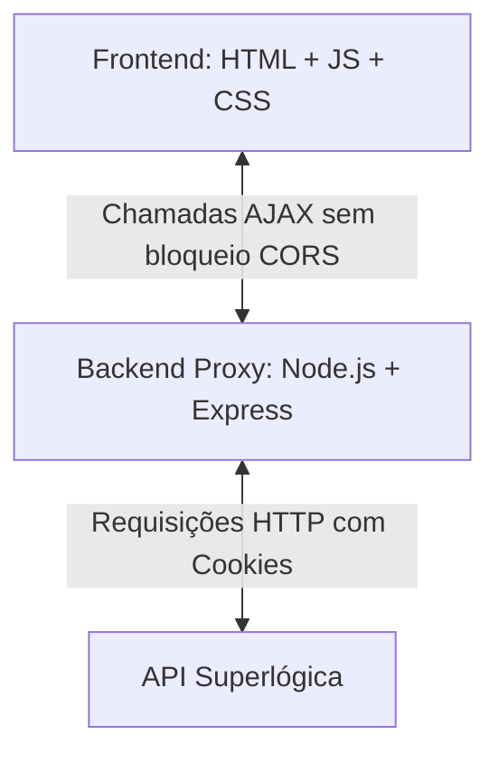

# Plano de Desenvolvimento: App Independente de Assembleias

Este documento apresenta o plano detalhado para migrar as funcionalidades do **Monitor de Assembleia (Superlógica)** de uma extensão de navegador para um site/web app independente, utilizando uma arquitetura leve adequada para servidores virtuais privados (VPS).

---

## 1. Arquitetura Proposta

Para contornar o bloqueio de **CORS** e manter o app extremamente leve (baixo consumo de memória e CPU na VPS), usaremos uma divisão simples:



*   **Frontend (SPA - Single Page Application):** HTML5, CSS (Vanilla ou Bootstrap/Tailwind via CDN) e Vanilla JS/jQuery. Rodará inteiramente no navegador do usuário, consumindo zero recursos da VPS além da entrega dos arquivos estáticos.
*   **Backend (Proxy de API):** Node.js com Express e a biblioteca Axios (ou `fetch` nativo). Rodará na VPS com consumo mínimo (~30MB a 50MB RAM).
*   **Banco de Dados:** **Nenhum**. A aplicação será *stateless* (sem estado). O backend apenas repassará a sessão do usuário (cookies) de volta para o cliente, que os armazenará no `localStorage` ou `sessionStorage`.

---

## 2. Fluxo de Autenticação e Sessão (Sem Banco de Dados)

Dado que apenas você usará o sistema, não há necessidade de banco de dados para salvar credenciais. O fluxo de sessão funcionará da seguinte forma:

1.  O usuário insere e-mail e senha na tela de login do Frontend.
2.  O Frontend envia os dados via `POST` para o seu Proxy Backend (`/api/login`).
3.  O Proxy faz o login na API da Superlógica:
    *   Captura os cabeçalhos `Set-Cookie` retornados pela Superlógica.
    *   Extrai os cookies cruciais (especialmente `PHPSESSID` e `server-id`).
4.  O Proxy responde ao Frontend com um JSON contendo os cookies extraídos.
5.  O Frontend salva essa string de cookies no `sessionStorage`.
6.  Em todas as chamadas futuras de dados (pautas, votos), o Frontend envia essa string de cookies no cabeçalho customizado (ex: `X-Superlogica-Token`).
7.  O Proxy recebe o cabeçalho, injeta no header `Cookie` e encaminha a chamada para a Superlógica.

---

## 3. Endpoints Detalhados do Proxy

O seu servidor backend Express exporá os seguintes endpoints:

### A. Autenticação e Login
*   **Rota no Proxy:** `POST /api/login`
*   **Payload do Frontend:**
    ```json
    {
      "email": "davi.nunes@gmail.com",
      "senha": "sua_senha_aqui"
    }
    ```
*   **Ação do Proxy:**
    Disparar requisição `POST` para:
    `https://solucoesdf.superlogica.net/areadocondomino/atual/publico/auth`
    *   **Headers:**
        `Content-Type: application/x-www-form-urlencoded`
    *   **Body (URL-encoded):**
        `email=davi.nunes%40gmail.com&senha=sua_senha_encoded&FL_LOGIN_WEB=1&salvar=Entrar`
    *   **Tratamento de Cookies:** Capturar a lista de cookies obtida do cabeçalho `set-cookie` e devolver ao Frontend.

### B. Listagem de Assembleias
*   **Rota no Proxy:** `GET /api/assembleias`
*   **Headers Enviados:** `X-Superlogica-Token: <cookies_salvos>`
*   **Ação do Proxy:**
    Disparar requisição `GET` para:
    `https://solucoesdf.superlogica.net/areadocondomino/atual/assembleiasv2/index?assembleias=proximas&comPautas=1` (e também opcionalmente para `assembleias=passadas`).
    *   **Headers:**
        `Cookie: <cookies_salvos>`

### C. Detalhes de Votos de uma Pauta
*   **Rota no Proxy:** `GET /api/pauta/votos?idPauta=<ID>`
*   **Headers Enviados:** `X-Superlogica-Token: <cookies_salvos>`
*   **Ação do Proxy:**
    Disparar requisição `GET` para:
    `https://solucoesdf.superlogica.net/areadocondomino/atual/pautasv2/votos?idPauta=<ID>&comOpcaoDeVoto=true&comQuantidadeFavoritos=true&idContato=0`
    *   **Headers:**
        `Cookie: <cookies_salvos>`

### D. Resultados Consolidados de uma Pauta
*   **Rota no Proxy:** `GET /api/pauta/resultado?idPauta=<ID>`
*   **Headers Enviados:** `X-Superlogica-Token: <cookies_salvos>`
*   **Ação do Proxy:**
    Disparar requisição `GET` para:
    `https://solucoesdf.superlogica.net/areadocondomino/atual/pautasv2/resultadovotacao?idPauta=<ID>`
    *   **Headers:**
        `Cookie: <cookies_salvos>`

### E. Listar Discussão (Chat) de uma Pauta
*   **Rota no Proxy:** `GET /api/pauta/discussao?idPauta=<ID>`
*   **Headers Enviados:** `X-Superlogica-Token: <cookies_salvos>`
*   **Ação do Proxy:**
    Disparar requisição `GET` para:
    `https://solucoesdf.superlogica.net/areadocondomino/atual/pautasv2/listardiscussao?daPauta=<ID>`
    *   **Headers:**
        `Cookie: <cookies_salvos>`

---

## 4. Requisitos para Execução e VPS

Para rodar essa aplicação na sua VPS, os únicos requisitos são:

1.  **Node.js (versão 18+):** Motor de execução do backend.
2.  **PM2 (Process Manager):** Para gerenciar e manter o processo do Node.js rodando em background infinitamente.
    ```bash
    npm install -g pm2
    pm2 start server.js --name "monitor-assembleia-proxy"
    ```
3.  **Nginx (Opcional, recomendado):** Como servidor web reverso para expor a aplicação na porta `80`/`443` com certificado SSL gratuito (Certbot/Let's Encrypt).

---

## 5. Práticas Recomendadas de Segurança

Como a aplicação trafega dados de login e cookies de sessão:
1.  **Uso Obrigatório de HTTPS:** É vital expor a rota da VPS sob HTTPS (SSL) para evitar que a sua senha seja interceptada em redes públicas (HTTP puro transmite senhas em texto aberto).
2.  **Validação Simples de IP (Opcional):** Como possivelmente só você vai usar, o seu backend proxy pode conter um Middleware de verificação de IP ou uma chave de acesso estática (`X-Access-Key`) no cabeçalho do Frontend para que outras pessoas não consigam usar a sua VPS de proxy para fazer chamadas à Superlógica.
